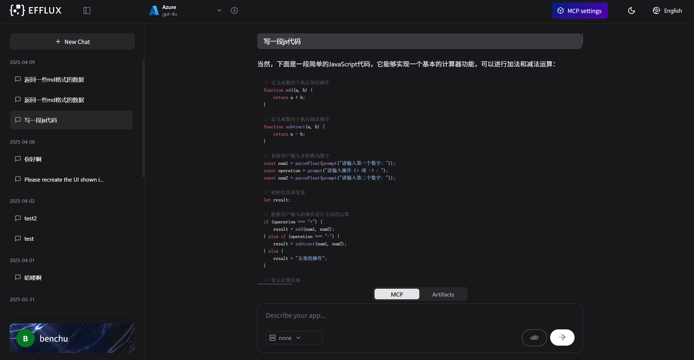
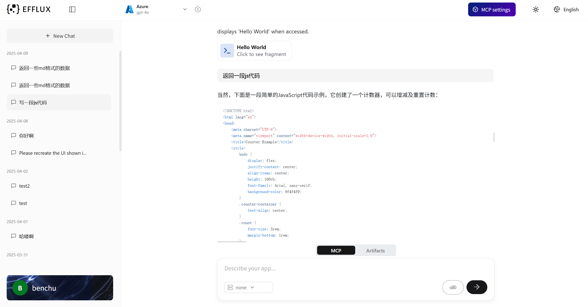
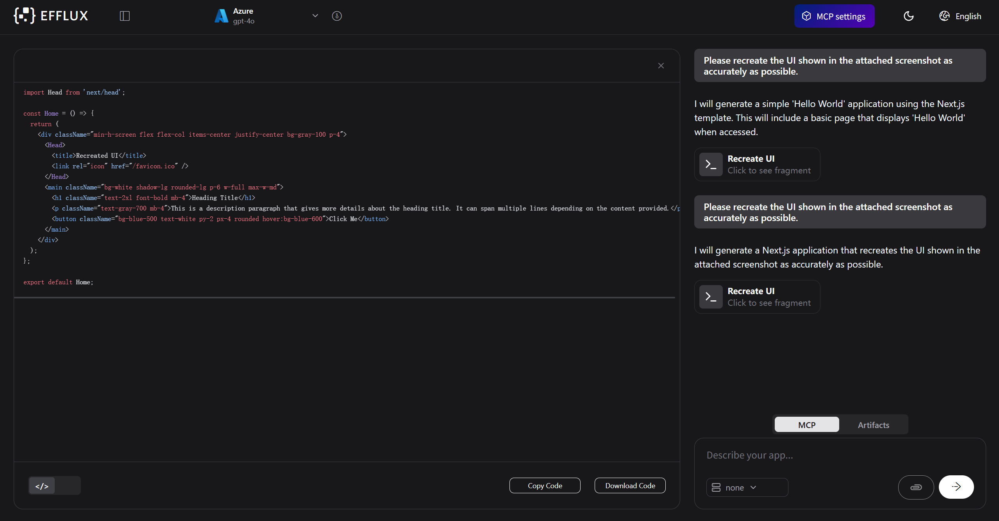
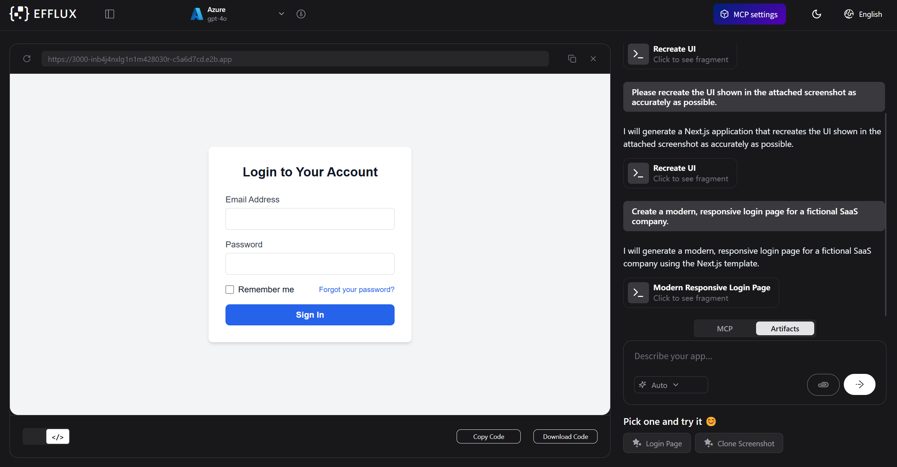

# EFFLUX

[English](./README.md) | [简体中文](./README_CN.md)

## Features

- Based on Next.js 14 (App Router, Server Actions), shadcn/ui, TailwindCSS, Vercel AI SDK.
- Uses the [E2B SDK](https://github.com/e2b-dev/code-interpreter) by [E2B](https://e2b.dev) to securely execute code generated by AI.
- Streaming in the UI.
- Can install and use any package from npm, pip.


## Interface Preview

### Main Interface



### Light Theme



### Code Generation


### Code Preview


## Get started


### 1. Clone the repository

In your terminal:

```
git clone https://github.com/isoftstone-data-intelligence-ai/efflux-frontend.git
```

### 2. Install the dependencies

Enter the repository:

```
cd efflux-frontend
```

Run the following to install the required dependencies:

```
npm i --force
```

### 3. Set the environment variables
Set the following variables:
For the dev environment, use /config/environments/dev.js
For the test environment, use /config/environments/test.js

```javascript
// Get the E2B API key here - https://e2b.dev/
module.exports = {
  'apiUrl': '/api',
  'e2bApiKey': 'your-e2b-api-key',
};
```

### 4. Start the development server

```
npm run dev
```

### 5. Build the web app

```
npm run build

# dev
# npm run build-dev 

# test
# npm run build-test
```