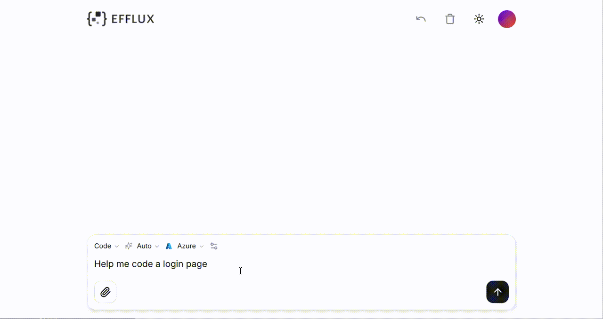

# Generate Code for UI Components

Efflux provides a chat-based interface where you can input text prompts and attach image files to get responses with generative code snippets of UI components. It supports real-time editing and customization to improve front-end development efficiency.

  

## How it Works

1. **Input Prompt**: Type text descriptions or upload images to let Efflux understand the required interface you want to build.
2. **Generate Code**: Efflux generates code using open-source tools, like React, Tailwind CSS, and Shadcn UI, based on your prompt.
3. **Preview and Edit**: Preview the rendered code and make real-time edits in Efflux to fit your needs.
4. **Integrate Code**: Copy and paste the desired code into your application.

## Example

This is an example of getting a code snippet for a simple login page.

On the **Preview** tab, you can check out the rendered code.

