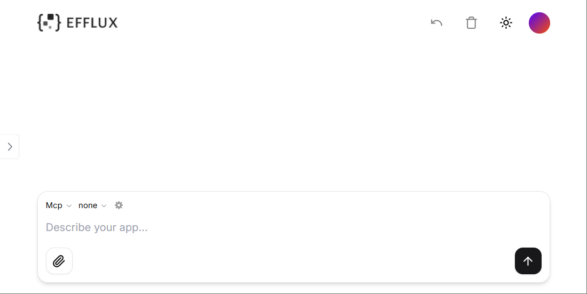

## Prerequisites

Make sure the following dependencies have been installed:

- Python 3.12 or higher versions

- Node.js 18 or higher versions

- [Git](https://git-scm.com/downloads)

- [Efflux backend service](https://github.com/isoftstone-data-intelligence-ai/efflux-backend?tab=readme-ov-file#quick-start)

## 1. Clone the Repository

In your terminal:

```sh
git clone https://github.com/isoftstone-data-intelligence-ai/efflux-frontend.git
```

## 2. Install the Dependencies

Enter the repository:

```sh
cd efflux-frontend
```

Run the following to install the required dependencies:

```sh
npm i
```

## 3. Set the Environment Variables

Create a `.env.local` file and set the following:

```sh
# Get your API key here - https://e2b.dev/
E2B_API_KEY="your-e2b-api-key"

# Get your Azure API key here https://learn.microsoft.com/en-us/azure/ai-services/openai/how-to/create-resource?tabs=portal
AZURE_API_KEY="your-azure-api-key"

# API URL
NEXT_PUBLIC_API_URL="your-backend-service-url"

# OpenAI API Key
OPENAI_API_KEY=

# Other providers
ANTHROPIC_API_KEY=
GROQ_API_KEY=
FIREWORKS_API_KEY=
TOGETHER_API_KEY=
GOOGLE_AI_API_KEY=
GOOGLE_VERTEX_CREDENTIALS=
MISTRAL_API_KEY=
XAI_API_KEY=

### Optional env vars

# Domain of the site
NEXT_PUBLIC_SITE_URL=

# Disabling API key and base URL input in the chat
NEXT_PUBLIC_NO_API_KEY_INPUT=
NEXT_PUBLIC_NO_BASE_URL_INPUT=

# Rate limit
RATE_LIMIT_MAX_REQUESTS=
RATE_LIMIT_WINDOW=

# Vercel/Upstash KV (short URLs, rate limiting)
KV_REST_API_URL=
KV_REST_API_TOKEN=

# Supabase (auth)
SUPABASE_URL=
SUPABASE_ANON_KEY=

# PostHog (analytics)
NEXT_PUBLIC_POSTHOG_KEY=
NEXT_PUBLIC_POSTHOG_HOST=
```

## 4. Start the Development Server

```sh
npm run dev
```

Then you can access your local efflux at http://localhost:3000. The landing page looks like the following:



## What's Next?

* [Generate Code](generate-code.md)

* [Work with MCP Server](work-with-MCP-server.md) 