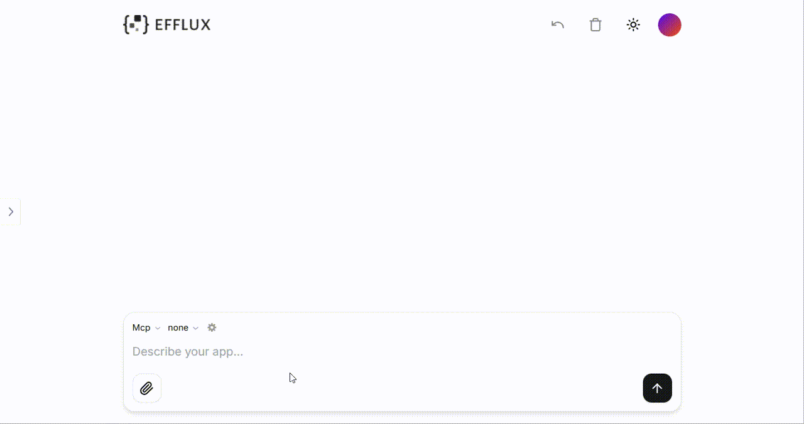
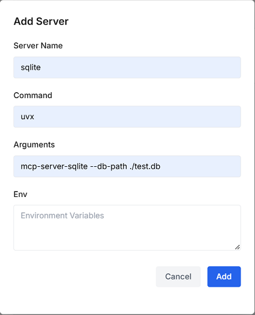
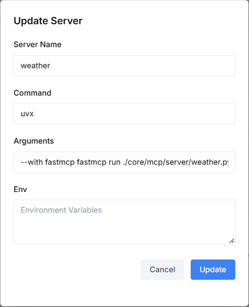

Model Context Protocol (MCP) is an open standard that enables frontier LLMs to produce more relevant responses by safely interacting with external tools and resources where data lives. For more details, go to [MCP Concepts](https://modelcontextprotocol.io/quickstart/server#core-mcp-concepts).

Many LLMs do not currently have the ability to access databases and customized tools, for example, fetch the forecasts and severe weather alerts. Efflux's native MCP support helps you build secure and controlled access to your external data sources and tools, and then chat with them to get grounded information. 

  

!!! tip
	For a comprehensive list of reference implementations of MCP servers, visit the [MCP SDK Repo](https://github.com/modelcontextprotocol/servers).

## Connect to Data Sources

This section introduces an example of how to set up an MCP connector to extend your data sources using [`Sqlite`](https://github.com/modelcontextprotocol/servers/tree/main/src/sqlite).

1. Prepare a database file named `demo.db` in the root directory of the efflux-backend service. Let's say, the file contains the following data:

	```
	Product List

	| ID | Name       | Price  | Stock | Description                   |
	|----|------------|--------|-------|-------------------------------|
	| 1  | Laptop     | 999.99 | 50    | High-performance laptop       |
	| 2  | Smartphone | 699.99 | 100   | Latest model smartphone       |
	| 3  | Headphones | 199.99 | 200   | Noise cancelling headphones   |
	| 4  | Smartwatch | 299.99 | 150   | Feature-packed smartwatch     |
	| 5  | Tablet     | 399.99 | 80    | 10-inch screen tablet         |
	```

2. Select **MCP** in the **Tools** dropdown of Efflux, and click the **Settings** icon to add an MCP server with the following parameters.

	

	=== "Json"
	```json
	{
		"sqlite": {
    	"command": "uvx",
    	"args": [
    		"mcp-server-sqlite",
    		"--db-path",
    		"./demo.db"
    		]
    	}
    }
	```

3. Select **sqlite** in the **Servers** dropdown, and prompt Efflux, for example, `list top 3 most expensive products`.

	Then you will get a response similar to the following:

	```
	Tool Calls: read_query Args: query: SELECT name, price FROM products ORDER BY price DESC LIMIT 3

	The top 3 most expensive products in your database are:

	Laptop with a price of 999.99

	Smartphone with a price of 699.99
	
	Tablet with a price of 399.99

	These products are listed in descending order based on their price.
	```

4. Continue to talk to Effllux based on your needs, for example, `can you provide a more structured reply with more information?`.

	Then you will get a response as follows:

	=== "Output"
	```
	Certainly! To provide a more detailed and structured reply, I will first retrieve comprehensive information for the top 3 most expensive products from the `products` table. Let's gather that information now.

	### Top 3 Most Expensive Products

	Below is a detailed and structured list of the top 3 most expensive products from your database, ordered by price in descending order:

	| ID | Name         | Price    | Stock | Description                  |
	|----|--------------|----------|-------|------------------------------|
	| 1  | Laptop       | $999.99  | 50    | High-performance laptop      |
	| 2  | Smartphone   | $699.99  | 100   | Latest model smartphone      |
	| 5  | Tablet       | $399.99  | 80    | 10-inch screen tablet        |

	These products are listed with additional details including their stock levels and descriptions. If you require any more information or further assistance, please let me know!
	```

## Connect to Customized Tools

This section introduces an example of how to set up an MCP connector to fetch weather forecasts and severe weather alerts using [`FastMCP`](https://github.com/jlowin/fastmcp).

1. Create and set up your project under the directory of your efflux-backend repo.

	=== "MacOS/Linux"
		```sh
		# Create a new directory for your project
		uv init weather
		cd weather

		# Create virtual environment and activate it
		uv venv
		source .venv/bin/activate

		# Install dependencies
		uv add "mcp[cli]" httpx

		# Create your server file
		cd ../core/mcp/server
		touch weather.py
		```

	=== "Windows"
		```sh
		# Create a new directory for your project
		uv init weather
		cd weather

		# Create virtual environment and activate it
		uv venv
		.venv\Scripts\activate

		# Install dependencies
		uv add mcp[cli] httpx

		# Create your server file
		new-item ./core/mcp/server/weather.py
		```

2. Paste the following content to the `/core/mcp/server/weather.py` file. 

	=== "Python"
	```python
	from typing import Any
	import httpx
	from fastmcp import FastMCP

	# Initialize FastMCP server
	mcp = FastMCP("weather")

	# Constants
	NWS_API_BASE = "https://api.weather.gov"
	USER_AGENT = "weather-app/1.0"

	# Helper functions
	async def make_nws_request(url: str) -> dict[str, Any] | None:
    	"""Make a request to the NWS API with proper error handling."""
    	headers = {
        	"User-Agent": USER_AGENT,
        	"Accept": "application/geo+json"
    	}
    	async with httpx.AsyncClient() as client:
        	try:
            	response = await client.get(url, headers=headers, timeout=30.0)
            	response.raise_for_status()
            	return response.json()
        	except Exception:
            	return None

	def format_alert(feature: dict) -> str:
    	"""Format an alert feature into a readable string."""
    	props = feature["properties"]
    	return f"""
	Event: {props.get('event', 'Unknown')}
	Area: {props.get('areaDesc', 'Unknown')}
	Severity: {props.get('severity', 'Unknown')}
	Description: {props.get('description', 'No description available')}
	Instructions: {props.get('instruction', 'No specific instructions provided')}
	"""

	# Implementing tool execution
	@mcp.tool()
	async def get_alerts(state: str) -> str:
    	"""Get weather alerts for a US state.

    	Args:
        	state: Two-letter US state code (e.g. CA, NY)
    	"""
    	url = f"{NWS_API_BASE}/alerts/active/area/{state}"
    	data = await make_nws_request(url)

    	if not data or "features" not in data:
        	return "Unable to fetch alerts or no alerts found."

    	if not data["features"]:
        	return "No active alerts for this state."

    	alerts = [format_alert(feature) for feature in data["features"]]
    	return "\n---\n".join(alerts)

	@mcp.tool()
	async def get_forecast(latitude: float, longitude: float) -> str:
    	"""Get weather forecast for a location.

    	Args:
        	latitude: Latitude of the location
        	longitude: Longitude of the location
    	"""
    	# First get the forecast grid endpoint
    	points_url = f"{NWS_API_BASE}/points/{latitude},{longitude}"
    	points_data = await make_nws_request(points_url)

    	if not points_data:
        	return "Unable to fetch forecast data for this location."

    	# Get the forecast URL from the points response
    	forecast_url = points_data["properties"]["forecast"]
    	forecast_data = await make_nws_request(forecast_url)

    	if not forecast_data:
        	return "Unable to fetch detailed forecast."

    	# Format the periods into a readable forecast
    	periods = forecast_data["properties"]["periods"]
    	forecasts = []
    	for period in periods[:5]:  # Only show next 5 periods
        	forecast = f"""
	{period['name']}:
	Temperature: {period['temperature']} {period['temperatureUnit']}
	Wind: {period['windSpeed']} {period['windDirection']}
	Forecast: {period['detailedForecast']}
	"""
        	forecasts.append(forecast)

    	return "\n---\n".join(forecasts)

	# Running the server
	if __name__ == "__main__":
  	# Initialize and run the server
  	mcp.run(transport='stdio')
	```

3. Select **MCP** in the **Tools** dropdown of Efflux, and click the **Settings** icon to add an MCP server with the following parameters.

	

	=== "Json"
	```json
	{
		"weather": {
      	"command": "uvx",
      	"args": [
        	"--with",
        	"fastmcp",
        	"fastmcp",
        	"run",
        	"./core/mcp/server/weather.py"
      		]
    	}
    }
	```

4. Select **weather** in the **Servers** dropdown, and prompt Efflux, for example, `What are the active weather alerts in NY?`.

	Then you will get a response similar to the following:

	=== "Output"
	```
	Here are the active weather alerts for New York (NY):

	**Special Weather Statement**

	- Area: Eastern Clinton, Southern Franklin, Western Clinton, Grand Isle, Western Franklin, Western Chittenden, Lamoille, Eastern Franklin

	- Severity: Moderate

	- Description: A snow squall was reported with winds 35 mph or greater and visibility less than a mile.

	- Instructions: Hazardous driving conditions due to rapid visibility reduction and potentially icy roads. Travel is not advised during this snow squall.


	**Lake Effect Snow Warning**

	- Area: Southern Herkimer

	- Severity: Extreme

	- Description: Heavy lake effect snow expected with total accumulations between 2 and 6 inches, up to 7 to 8 inches in some areas. Winds gusting as high as 50 mph.

	- Instructions: Plan on slippery road conditions and hazardous commutes. Be prepared for rapid changes in weather, visibility, and road conditions.


	**Wind Advisory**

	- Area: Multiple counties including Northern Berkshire, Southern Berkshire, Eastern Rensselaer, Eastern Columbia, Bennington, Western Windham, Eastern Windham, Northern Litchfield, Southern Herkimer, etc.

	- Severity: Moderate

	- Description: West winds 15 to 25 mph with gusts up to 40 to 55 mph expected.

	- Instructions: Gusty winds will blow around unsecured objects. Tree limbs could be blown down and a few power outages may result. Use extra caution while driving.

	
	**Winter Weather Advisory**

	- Area: Chautauqua, Cattaraugus, Southern Erie, Wyoming, Wayne

	- Severity: Moderate

	- Description: Additional snow accumulations of 2 to 6 inches, with winds gusting as high as 35 mph.

	- Instructions: Travel will be difficult with areas of blowing snow significantly reducing visibility. Slow down and use caution while driving.


	**Lake Effect Snow Warning**

	- Area: Northern Cayuga, Oswego

	- Severity: Extreme

	- Description: Total snow accumulations 7 to 14 inches in the most persistent lake snows. Winds gusting 35 to 45 mph.

	- Instructions: Travel will be very difficult with hazardous conditions impacting morning and evening commutes. Be prepared for rapidly changing road conditions and visibilities.


	These alerts indicate severe winter weather conditions across various parts of New York State. If you're in any of these areas, please take necessary precautions, especially if traveling. Keep an eye on local news and weather updates for real-time information.
	```