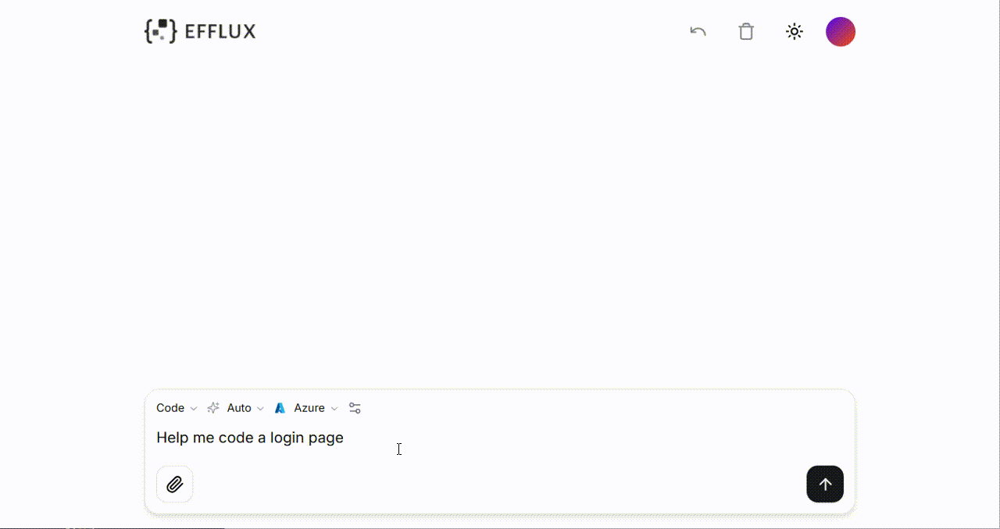
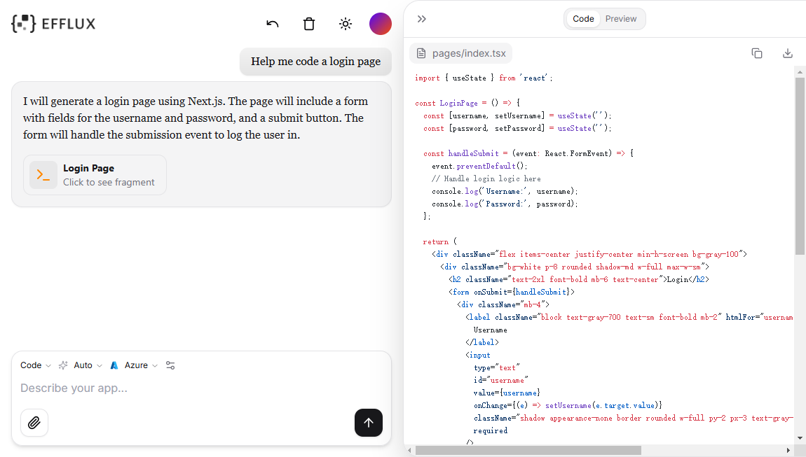
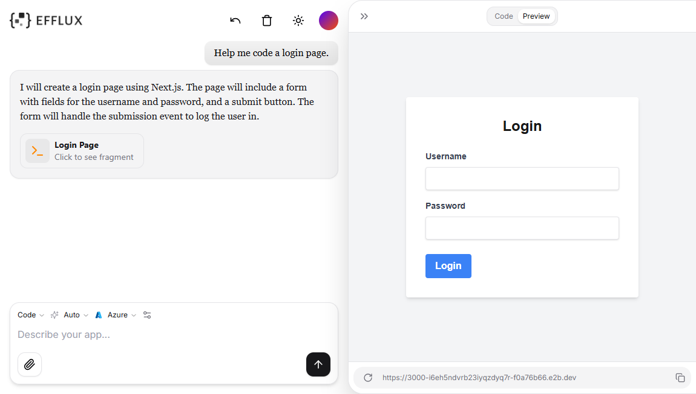
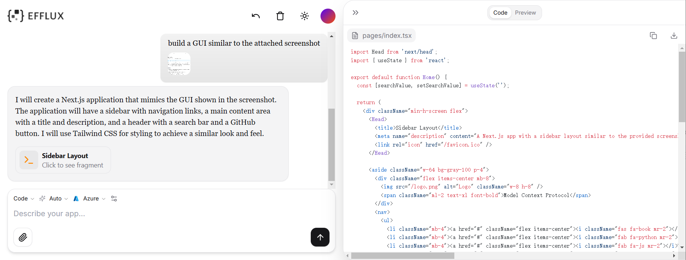
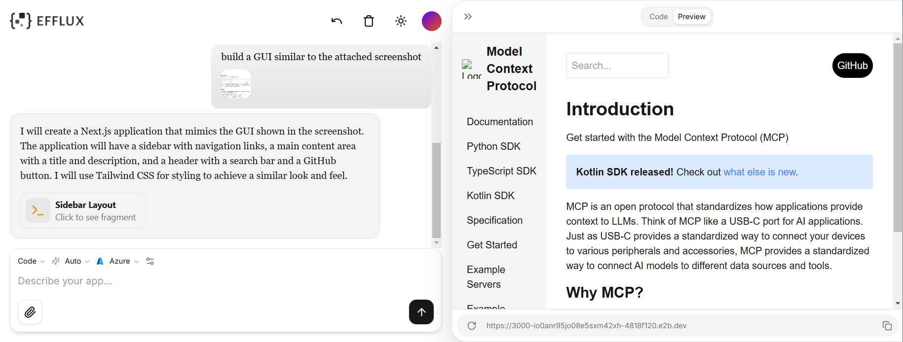

Efflux provides a chat-based interface where you can input text prompts to get responses with generative code snippets. For UI components, Efflux can render the generated code and provide an interactive environment for you to try it out. What's more, you can upload image files of UI components to build similar pages with one click. 

  

## How it Works

1. **Input Prompt**: Type text descriptions or upload images to let Efflux understand the required interface you want to build.
2. **Generate Code**: Efflux generates code using open-source tools, like React, Tailwind CSS, and Shadcn UI, based on your prompt.
3. **Preview and Edit**: Preview the code and make real-time edits in Efflux to fit your needs.
4. **Integrate Code**: Copy and paste the desired code into your application.

## Example of Text-to-UI

The following is an example of generating a simple login page.

On the **Preview** tab, you can check out the rendered code for your desired UI component.

## Example of Image-to-UI

The following is an example of generating a similar user interface based on the uploaded image.

On the **Preview** tab, you can check out the rendered code for your desired UI component.

It can be a good starting point for you to iterate the GUI.