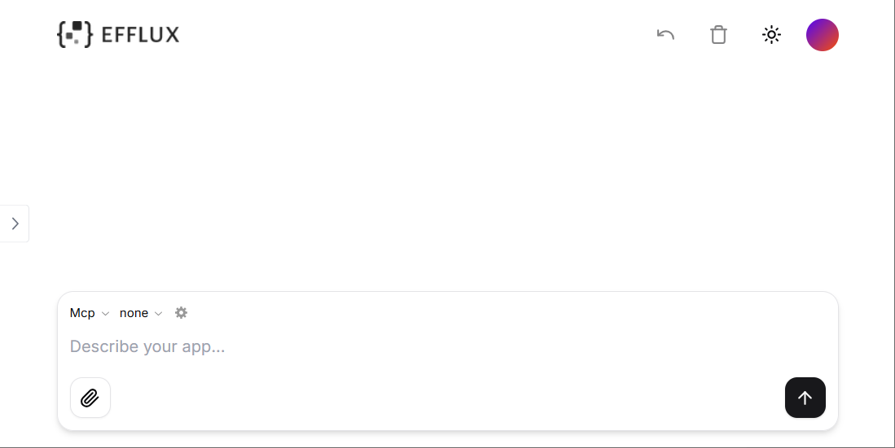

## Prerequisites

Make sure the following dependencies have been installed:

- Python 3.12 or higher versions

- Node.js 18 or higher versions

- [Git](https://git-scm.com/downloads)

- [Efflux backend service](https://github.com/isoftstone-data-intelligence-ai/efflux-backend?tab=readme-ov-file#quick-start)

## Set up Backend Service

1. Clone the project.

    ```sh
    git clone git@github.com:isoftstone-data-intelligence-ai/efflux-backend.git
    cd efflux-backend
    ```

2. Install `uv`.

    ```sh
    pip install uv
    ```

3. Reload dependencies.

  ```sh
  uv sync --reinstall
  ```

4. Activate virtual environment.

  ```sh
  # Activate virtual environment
  source .venv/bin/activate   # MacOS/Linux

  # Deactivate when needed
  deactivate
  ```

5. Configure environment variables.

  ```sh
  # Copy environment variable template
  cp .env.sample .env

  # Edit .env file, configure:
  # 1. Database connection info (DATABASE_NAME, DATABASE_USERNAME, DATABASE_PASSWORD)
  # 2. At least one LLM configuration (e.g., Azure OpenAI, Qwen, Doubao, or Moonshot)
  ```

6. Select the LLM.

  ```sh
  # Edit core/common/container.py file
  # Find the llm registration section, replace with any of the following models (Qwen by default):
  # - QwenLlm: Qwen
  # - AzureLlm: Azure OpenAI
  # - DoubaoLlm: Doubao
  # - MoonshotLlm: Moonshot

  # Example: Using Azure OpenAI
  from core.llm.azure_open_ai import AzureLlm
  # ...
  llm = providers.Singleton(AzureLlm)
  ```

7. Start PostgreSQL database.

  ```sh
  # Method 1: If PostgreSQL is installed locally
  # Simply start your local PostgreSQL service

  # Method 2: Using Docker (example)
  docker run -d --name local-postgres \
      -e POSTGRES_DB=your_database_name \
      -e POSTGRES_USER=your_username \
      -e POSTGRES_PASSWORD=your_password \
      -p 5432:5432 \
      postgres

  # Note: Ensure database connection info matches the configuration in your .env file
  ```

8. Initialize the database.

  ```sh
  # Create a new version and generate a migration file in alembic/versions
  alembic revision --autogenerate -m "initial migration"

  # Preview SQL to be executed:
  alembic upgrade head --sql

  # If preview looks good, execute migration
  alembic upgrade head
  ```

9. Start the service.

  ```sh
  python -m uvicorn main:app --host 0.0.0.0 --port 8000
  ```

## Set up Frontend Service

1. Clone the repository.

```sh
git clone https://github.com/isoftstone-data-intelligence-ai/efflux-frontend.git
```

2. Install the dependencies.

```sh
cd efflux-frontend
npm i
```

3. Create a `.env.local` file and set the environment variables as follows:

```sh
# Get your API key here - https://e2b.dev/
E2B_API_KEY="your-e2b-api-key"

# Get your Azure API key here https://learn.microsoft.com/en-us/azure/ai-services/openai/how-to/create-resource?tabs=portal
AZURE_API_KEY="your-azure-api-key"

# API URL
NEXT_PUBLIC_API_URL="your-backend-service-url"

# OpenAI API Key
OPENAI_API_KEY=

# Other providers
ANTHROPIC_API_KEY=
GROQ_API_KEY=
FIREWORKS_API_KEY=
TOGETHER_API_KEY=
GOOGLE_AI_API_KEY=
GOOGLE_VERTEX_CREDENTIALS=
MISTRAL_API_KEY=
XAI_API_KEY=

### Optional env vars

# Domain of the site
NEXT_PUBLIC_SITE_URL=

# Disabling API key and base URL input in the chat
NEXT_PUBLIC_NO_API_KEY_INPUT=
NEXT_PUBLIC_NO_BASE_URL_INPUT=

# Rate limit
RATE_LIMIT_MAX_REQUESTS=
RATE_LIMIT_WINDOW=

# Vercel/Upstash KV (short URLs, rate limiting)
KV_REST_API_URL=
KV_REST_API_TOKEN=

# Supabase (auth)
SUPABASE_URL=
SUPABASE_ANON_KEY=

# PostHog (analytics)
NEXT_PUBLIC_POSTHOG_KEY=
NEXT_PUBLIC_POSTHOG_HOST=
```

4. Start the development server.

```sh
npm run dev
```

Then you can access your local efflux at http://localhost:3000. The landing page looks like the following:



## What's Next?

* [Generate Code](generate-code.md)

* [Work with MCP](work-with-mcp.md) 