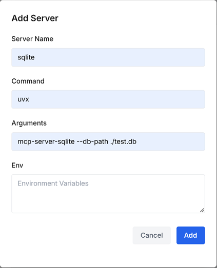
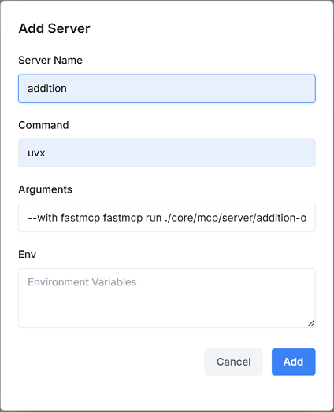

Model Context Protocol (MCP) is an open standard that enables frontier LLMs to produce more relevant responses by safely interacting with external tools and resources where data lives.

- **Resources**: Data (like API responses or file contents) that can be read by the selected LLM.
- **Tools**: Functions that can be called by the selected LLM.

Efflux's native MCP support helps you build secure and controlled access to your external data sources and tools, and then chat with them to get grounded information. 

!!! tip
	For a comprehensive list of reference implementations of MCP servers, visit the [MCP SDK Repo](https://github.com/modelcontextprotocol/servers).

## Connect to Data Sources

This section introduces an example of how to set up an MCP connector to extend your data sources using [`Sqlite`](https://github.com/modelcontextprotocol/servers/tree/main/src/sqlite).

1. Prepare a database file named `demo.db` in the root directory of the efflux-backend service. Let's say, the file contains the following data:

	```
	Product List

	| ID | Name       | Price  | Stock | Description                   |
	|----|------------|--------|-------|-------------------------------|
	| 1  | Laptop     | 999.99 | 50    | High-performance laptop       |
	| 2  | Smartphone | 699.99 | 100   | Latest model smartphone       |
	| 3  | Headphones | 199.99 | 200   | Noise cancelling headphones   |
	| 4  | Smartwatch | 299.99 | 150   | Feature-packed smartwatch     |
	| 5  | Tablet     | 399.99 | 80    | 10-inch screen tablet         |
	```

2. Select **MCP** in the **Tools** dropdown of Efflux, and click the **Settings** icon to add an MCP server with the following parameters.

	

	```json
	{
		"sqlite": {
    	"command": "uvx",
    	"args": [
    		"mcp-server-sqlite",
    		"--db-path",
    		"./demo.db"
    		]
    	}
    }
	```

3. Select **sqlite** in the **Servers** dropdown, and prompt Efflux, for example, `list top 3 most expensive products`.

	Then you will get a response as follows:

	```
	Tool Calls: read_query Args: query: SELECT name, price FROM products ORDER BY price DESC LIMIT 3

	The top 3 most expensive products in your database are:

	Laptop with a price of 999.99

	Smartphone with a price of 699.99
	
	Tablet with a price of 399.99

	These products are listed in descending order based on their price.
	```

4. Continue to talk to Effllux based on your needs, for example, `can you provide a more structured reply with more information?`.

	Then you will get a response as follows:

	```
	Certainly! To provide a more detailed and structured reply, I will first retrieve comprehensive information for the top 3 most expensive products from the `products` table. Let's gather that information now.

	### Top 3 Most Expensive Products

	Below is a detailed and structured list of the top 3 most expensive products from your database, ordered by price in descending order:

	| ID | Name         | Price    | Stock | Description                  |
	|----|--------------|----------|-------|------------------------------|
	| 1  | Laptop       | $999.99  | 50    | High-performance laptop      |
	| 2  | Smartphone   | $699.99  | 100   | Latest model smartphone      |
	| 5  | Tablet       | $399.99  | 80    | 10-inch screen tablet        |

	These products are listed with additional details including their stock levels and descriptions. If you require any more information or further assistance, please let me know!
	```

## Connect to Tools

This section introduces an example of how to set up an MCP connector to utilize a function using [`FastMCP`](https://github.com/jlowin/fastmcp).

1. Prepare a python file named `addition-operator.py` to the `/core/mcp/server/` directory of the efflux-backend service. Let's say, the file contains the following script to perform an addition operation:

	```python
	from fastmcp import FastMCP


	# Create an MCP server
	mcp = FastMCP("Demo")


	# Add an addition tool
	@mcp.tool()
	def add(a: int, b: int) -> int:
    	"""Add two numbers"""
    	return a + b
	```

2. Select **MCP** in the **Tools** dropdown of Efflux, and click the **Settings** icon to add an MCP server with the following parameters.

	

	```json
	{
		"Addition": {
      	"command": "uvx",
      	"args": [
        	"--with",
        	"fastmcp",
        	"fastmcp",
        	"run",
        	"./core/mcp/server/addition-operator.py"
      		]
    	}
    }
	```

3. Select **Addition** in the **Servers** dropdown, and prompt Efflux, for example, `121+234=?`.

	Then you will get a response as follows:

	```
	Tool Calls: add Args: a: 121 b: 234
	The result of adding 121 and 234 is 355.
	```